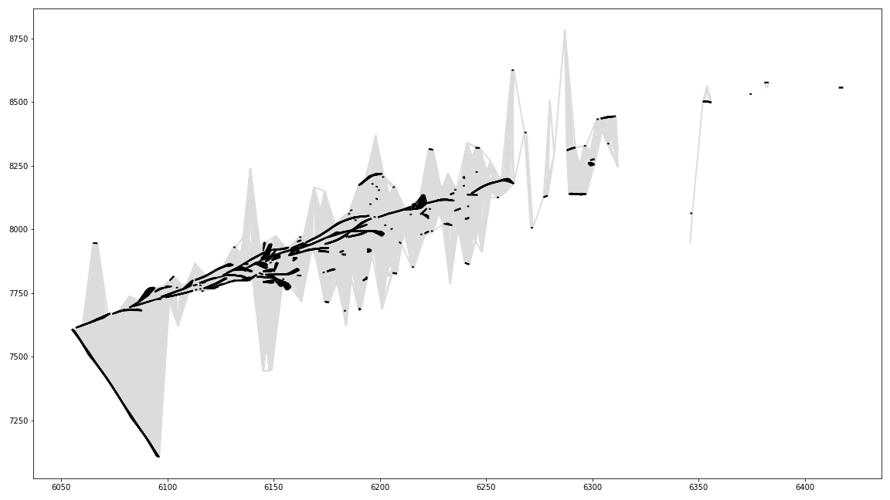
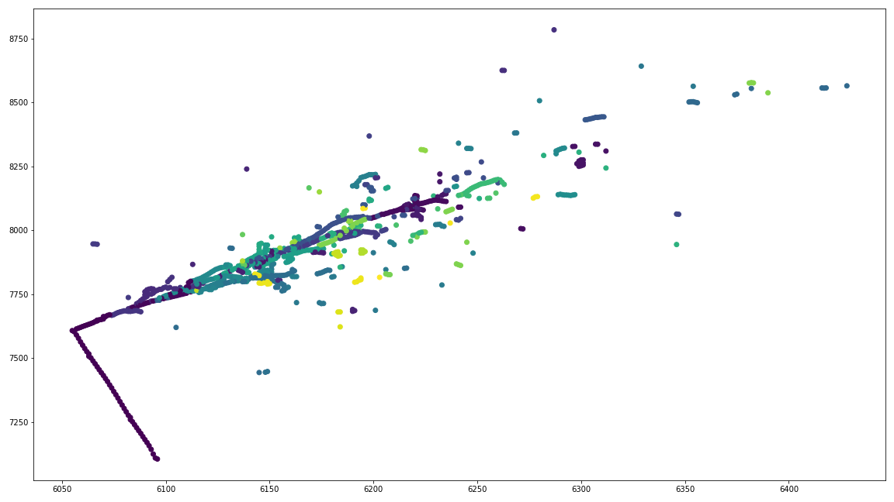
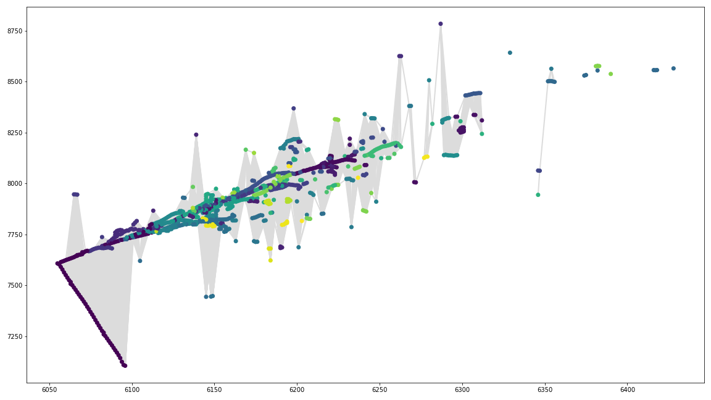
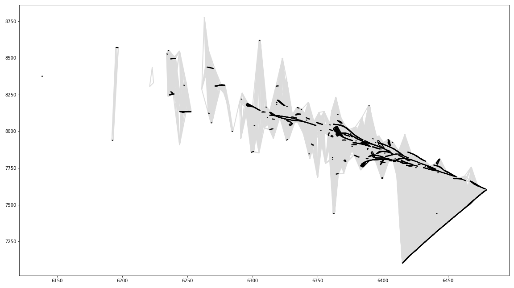
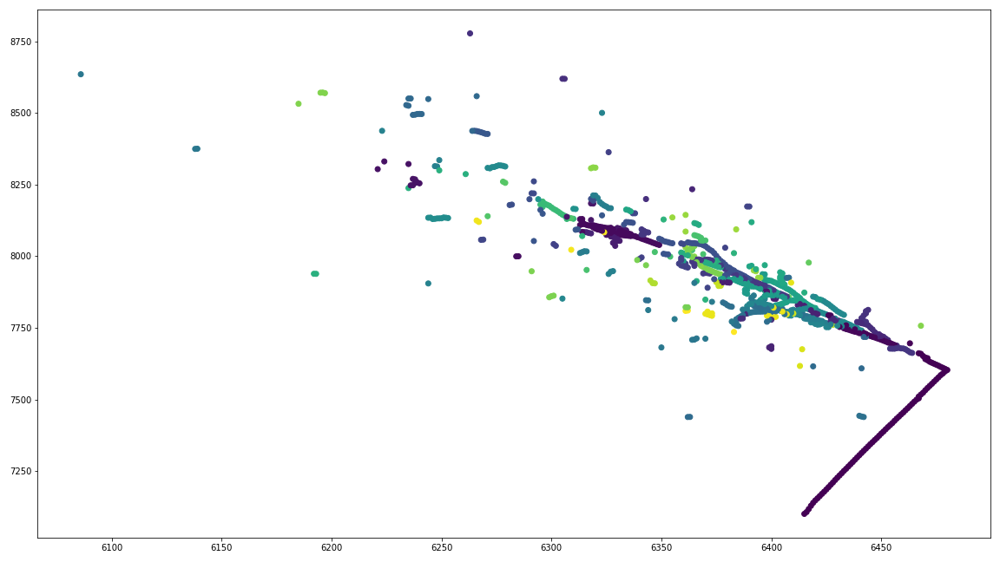
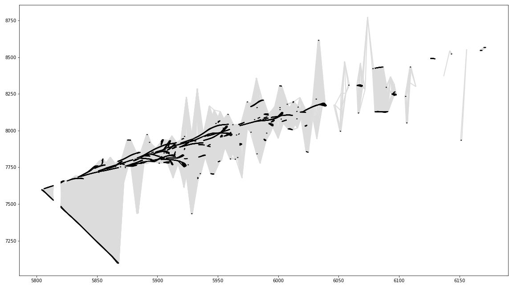
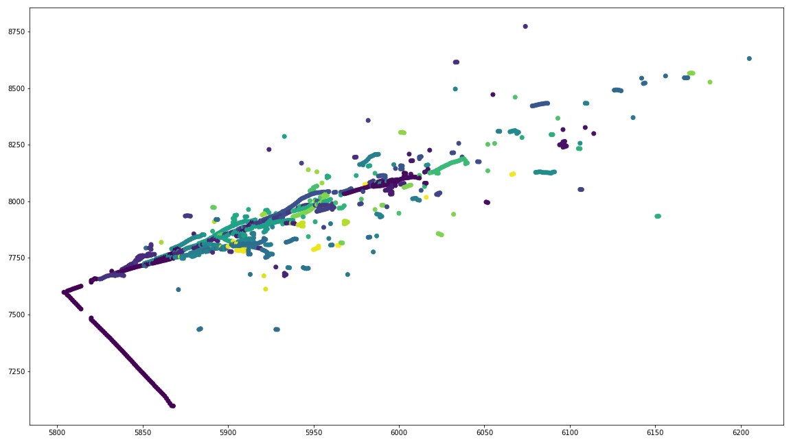
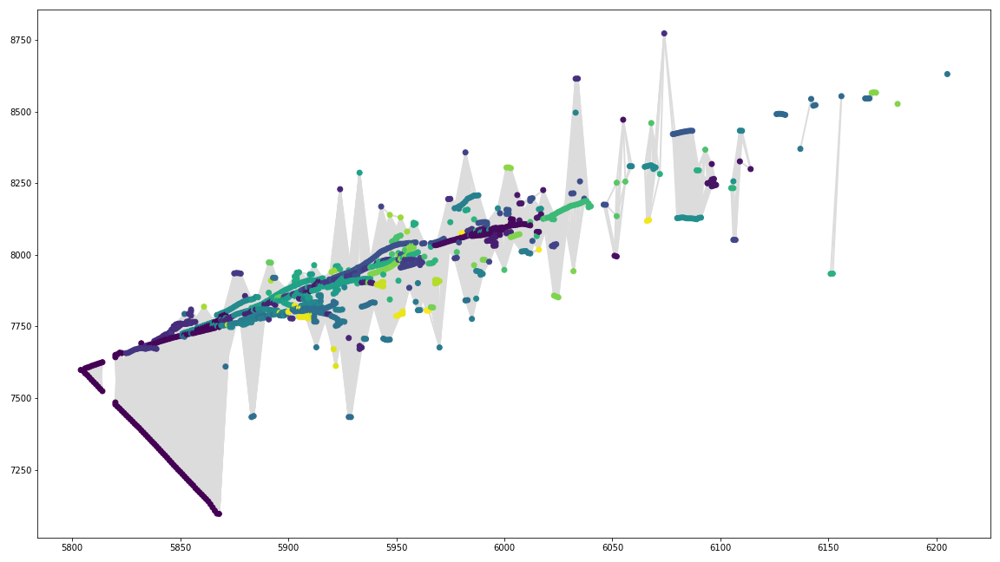

# GNN load_files.ipynb Summary 

## Datasets
Two HDF5 datasets are used in this application: nonswap and fluxswap files.
Nonswap: uses unoscillated neutrino flux from simulated beamline (consists of mostly muon interactions)
Fluxswap: switch muon and electron neutrino fluxes (consists of mostly electron neutrino interactions)

## HDF File Structure 
Each HDF5 file contains three tables: 
1)	Event tree:  Each row holds one event comprised of a set of unique identifiers (run, subrun, event number) and metadata (neutrino energy)
2)	Graph tree: Holds information on each hit and simulated particle and the three unique identifiers 
3)	Particle tree: Contains the same information as the graph tree 

Hit and particle information for an event is extracted by choosing an event from the event tree and using its unique identifiers to index into the other two trees. 

## Functions for Information Retrieval
	* get_graph(idx): Returns the graph nodes by extracting the unique identifiers (run, subrun, event number) from the event tree and using it to index into the graph tree 

	* get_particles(idx): Returns the graph nodes by extracting the unique identifiers (run, subrun, event number) from the event tree and using it to index into the particle tree 

	* get_particle_type(idx): Queries the true particle (i.e. the simulated particle responsible for depositing the majority of energy for each hit) for each hit and returns the corresponding true particle 

	* get_process(idx): Returns the process of the true particle 

	* create_edges(idx): Constructs graph edges based on hit proximity. An edge is produced with a pair of indices pointing from one hit to the other if two hits are within 5 wires of each other  

## Plot Generation 
By iterating over all event in the file and each plane within the event the following graphs are generated:
1)	The graph containing the nodes (hits) color coded by the simulated particle that produced the hit
2)	The same node plot with all potential graph edges in grey
3)	The graph containing only edges with false edges in grey and true edges (an edge between two graph nodes produced by the same true particle) in black

## Output Graph Plots
The following sample HDF files were used to generate a sample graph

Nonswap: gcnhit_004a7d87-4609-4efb-a7c5-a92338c28245.h5

Fluxswap: gcnhit_002ff553-c67e-461d-99f8-1a700ecbc78c.h5

PNG images: 
These output images (shown below) varied with event number, plane (0,1, or 2), and the type of information displayed (edges, nodes, entire plane). The following images provide the output graphs for a single event. 

Figure 1. Event 70: plane 0, edge graph

Figure 2. Event 70: plane 0, node graph

Figure 3. Event 70: plane 0, node+edge graph

Figure 4. Event 70: plane 1, edge graph

Figure 5. Event 70: plane 1, node graph

Figure 6. Event 70: plane 1, node+edge graph

Figure 7. Event 70: plane 2, edge graph

Figure 8. Event 70: plane 2, node graph

Figure 9. Event 70: plane 2, node+edge graph

# Meeting Note (May 20, 2020)
## Questions and Answers
  * Q1. What is the purpose of coloring the nodes and edges (problem definition)?
  * A1. Fermi considers a classification problem such that, given many observed hits and their particle types, a GNN model learns how to classify the hits into one of the given particle types so that all the particle tracks are found.

  * Q2. How are the edges colored (black/grey)?
  * A2. Every pair of hits that satisfy all of the following three conditions are connected by a black (true) edge
    * If two hits are within 5 wires of each other 
    * If two hits are from the same particle (have the same particle ID)
    * If two hits are within the same time frame 

  * Q3. Are there any other data that can be considered as the actual 'true' edges?
  * A3. Currently, no. These black edges will be used as labels in the edge classification problem. However, there is an ongoing discussion about whether an edge classification task is the way to go about particle track reconstruction (i.e. graph pooling approach). 
 
  * Q4. Is GNN training compute-intensive?
  * A4. Jeremy's current network is quite shallow and takes less than 1 hour on a single GPU to get an acceptable accuracy. However, we need to check if they have more data and a deeper and larger network can provide a better accuracy (I believe it's most likely true).

  * Q5. Why are 'fluxswap' files used only?
  * A5. The 'fluxswap' files contain the data of electron neutrino interactions while 'nonswap' files contains the muon neutrino. The 'nonswap' files end up with a lack of internal structure to map, therefore creating a trivial problem for the network to solve. On the other hand, phenomena such as the 'electromagnetic shower events' in the 'fluxswap' files show more interesting information to HEP scientists.

# Meeting Note (June 17, 2020)
## Summary of Discussion

  1. A single training sample is a graph generated from all the hits of a single particle (event).
  2. Each sample has different sizes due to the different number of hits.
  3. His batch size (40) is limited by the memory space of 2 GPUs (16 x 2 GiB).
  4. The current message passing neural network architecture is a preliminary design and we can consider any different structures.
