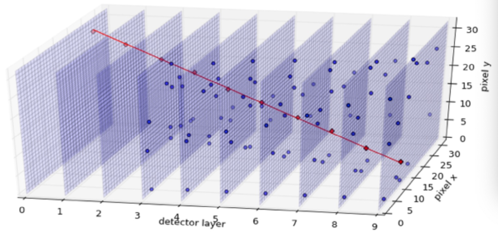

The output of using cProfile python profiler and the snakeviz visualization tool on dune gcn GNN code:

The original output file of cProfile can be found in the same directory. To run the snakeviz visualization tool, simply run 'snakeviz output.prof'