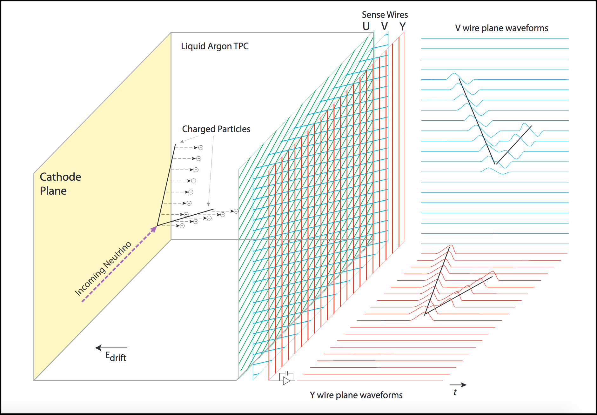
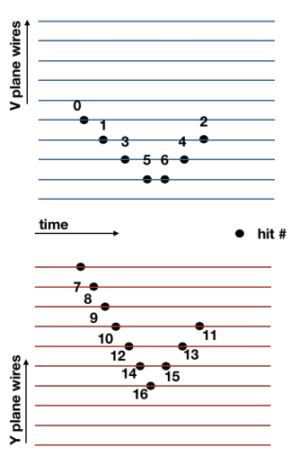

## HEP Particle Tracking Project for Dune GNN Dataset
* Liquid Argon Time Projection Chamber (LArTPC) is a detector for neutrino experiments and proton decay searches
* The drift chamber tracks the drift of the ghost (echo) outputs of the collision
* Each of the planes (U,V,Y) are pointed in a different direction to predict the type of particles
* Different types of particles produce different particles produce different angles on the planes
* Physical wires are located on the plane and are used as a distance unit

* Current DUNE dataset is preprocessed version of original detector output
* Hits are identified by wire readout and deconvolution is performed to differentiate different track hits
* Original data consists of pulse hits and there is fuzziness around details such as the size of the hit

### LArTPC vs. LHC (Large Hadron Collider)
* LArTPC has less tracks (~100s) than LHC-like detectors (~1000s)
* Fundamental experiments are the same but graph construction is different  

## FermiLab Collaboration
* Problem Definition: Reconstruct trajectories of charged particles from collision event by correctly classify the path of the particle
* Input Dataset: DUNE HDF5 Dataset
  + Cori File Paths to Dataset: /global/cscratch1/sd/csl/hit2d
    * fluxswap dataset: /global/cscratch1/sd/csl/hit2d/fluxswap
    * nonswap dataset: /global/cscratch1/sd/csl/hit2d/nonswap
* Processed Dataset: Pytorch Dataset
  + Cori File Paths to Dataset: /global/cscratch1/sd/csl/processed
* Model output: Classification of true or false edges in particle reconstruction graph

## References
1. [Exa.Trk.X Proposal](https://indico.physics.lbl.gov/event/898/contributions/3701/attachments/1929/2418/ExaTrkX_Proposal-243931.pdf), 2019
2. [Graph Neural Networks for Reconstruction in DUNE](https://indico.fnal.gov/event/46736/contributions/203490/attachments/138073/172668/2020-12-04_CLARIPHY_talk.pdf), 2020
