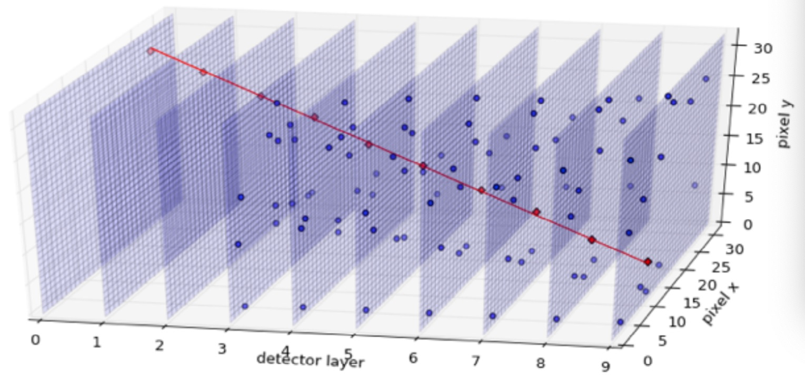

## Study Note of HEP Particle Tracking Projects

* LHC experiment data consists of many slices, each corresponding to a detector layer.
  Slices are collected throughout a sequence of time. Each slice has a unique time stamp.
* Base on reference 2, the workflow of particle tracking consists of the following 4 stages.
  1. hit clustering
  2. seed finding
  3. track building
  4. track fitting

* **Hit clustering**
  + **Hit** -- A hit is a particle location detected on a slice (detector layer).
  + Data clustering algorithm is applied on each slice to identify individual
    particles from those pixels, so each particle is repredented by its 3D coordinates.
  + Applicatioon of clustering on the raw data slice is necessary, because a particle
    may be captured by multiple detector wires and appear in multiple pixels, e.g. a
    pixel and its surrounding pixels.
  + There are O(10^8) pixels and *hit clustering* reduces it to O(10^5).
  + Hits are the vertices in the graph representation.
  + **ML methods used**
    * Shallow neural networks are used to identify shared cluster.
* **Seed finding**
  + **Seed** -- A seed is a tuple of 3 coordinates from 3 consecutive slices,
    also referred as *triplet*.
    * A seed can also be a *doublet*, i.e. from 2 hits on two consecutive slices.
    * A seed is the smallest set of space-points that allows to estimate the track curvature.
  + Seeds are selected based on the doublet/triplet geometry, its momentum, and its perigee.
  + **ML methods used**
    * **TODO**: to collect from papers
* **Track building**
  + Seeds found and constructed from the seed finding stage are just candidates of tracks.
  + Filtering out the "fake" seeds is required before building tracks.
  + **TODO**: need to collect more info about the remaining building process after filtering.
  + **ML methods used**
    * Combinatorial Kalman Filter (CKF) is a well-known method that is very efficient to filter out fake seeds
    * CKF is known to be computational expensive and not scalable.
    * RNN, LSTM, see reference 4. Given a sequence of hits, the model is built to predict the next hit.
      So, a track can be constructed/expanded by the sequence.
    
* **Track fitting**
  + A full resolution fit is performed on the final set of track candidates.
  + Each seed can have multiple candidate edges.
  + True edge must be identified, so the entire particle track can be constructed.
  + **ML methods used** that generate models to classify an edge into *true* and *fake*.
    * CNN that takes images, i.e. pixels, for training and testing
    * LSTM that takes sequences of data points (coordinates)
    * GNN that takes graph data, i.e. V and E
      + Vertex set V is a collection of track candidates.
      + Edges? **TODO** How is the grapgh  constructed?
      + Message passing learning passes 'learning' around neighbors of a vertex
      + See reference 4.

## TrkX Project Home Pages
1. [Exa.TrkX](https://exatrkx.github.io) Project Home Page, including URL to github repo
2. [HEP.TrkX](https://heptrkx.github.io) Project Home Page, including URL to github repo

## Open data sets
1. [TrackML Particle Tracking Challenge](https://www.kaggle.com/c/trackml-particle-identification) --
   data from a collision between proton bunches at the Large Hadron Collider at CERN.
   The goal is to group the recorded measurements or hits for each event into tracks,
   sets of hits that belong to the same initial particle.
   
## References
1. [Exa.TrkX all-hands meeting](https://indico.fnal.gov/event/23974/), April 7, 2020.
2. [The HEP.TrkX Project: deep neural networks for HL-LHC online and offline tracking](https://lss.fnal.gov/archive/2017/conf/fermilab-conf-17-326-cd.pdf), 2017.
3. [Graph Neural Networks for Particle Reconstruction in High Energy Physics detectors](https://arxiv.org/pdf/2003.11603.pdf), 2020.
4. [Novel deep learning methods for track reconstruction](https://arxiv.org/abs/1810.06111), 2018
