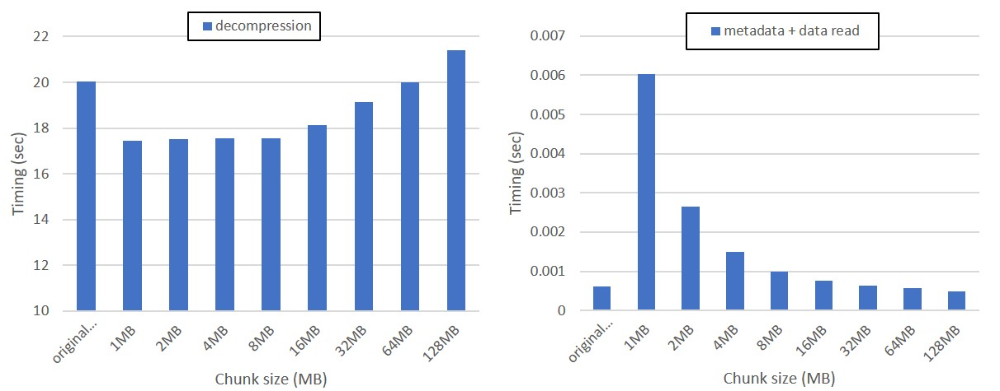
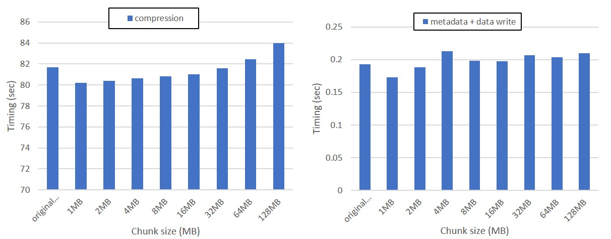

# Note for Developers

### Table of contents
- [Characteristics and Structure of Neutrino Experimental Data](#characteristics-and-structure-of-neutrino-experimental-data)
- [HDF5 Limitations](#hdf5-limitations)
  + [Parallel I/O for Datasets with Compression Enabled](#parallel-io-for-datasets-with-compression-enabled)
  + [Chunk Ownership](#chunk-ownership)
  + [Metadata Operation Modes](#metadata-operation-modes)
  + [Slow Parallel Dataset Creation](#slow-parallel-dataset-creation)
  + [Adjustable Metadata Cache Size](#adjustable-metadata-cache-size)
  + [Raw Data Chunk Caching](#raw-data-chunk-caching)
  + [Reading Partial Chunk](#reading-partial-chunk)
  + [Reading and Writing the Whole Dataset](#reading-and-writing-the-whole-dataset)
  + [Impact of Chunk Size on Compression/Decompression time](#impact-of-chunk-size-on-compressiondecompression-time)
- [Our Design](#our-design)
  + [Parallel Read Strategy](#parallel-read-strategy)
  + [Parallel Write Strategy](#parallel-write-strategy)
- [HDF5 Bugs](#hdf5-bugs)

---
## Characteristics and Structure of Neutrino Experimental Data
* Data Objects and Their Structures in Input Files
  - There are two Neutrino Detector: **"Near Detector"** (ND) and **"Far
    Detector"** (FD).
    + Each detector contains many sensors referred as "wires", multiple wires
      form a wire panel.  A wire panel can collect data organized in 2D space.
    + These sensors detect and record the voltage signals into files. Files
      were in ROOT format and later converted into HDF5 file format.
  - An experiment consists of multiple **"runs"** and each run consists of
    multiple **"subruns"**.  Each HDF5 file contains data of a subrun and
    thus has run ID and subrun ID as part of its name. For example, the file
    below contains data from run ID of 00011990 and
    subrun ID of 09 (on date of 2019-02-23, CAF: Common Analysis Format, a ROOT file format).
    ```
    neardet_r00011990_s09_t00_R19-02-23-miniprod5.i_v1_data.h5caf.h5
    ```
    **TODO**: Ask Fermi folks what are **"runs"** and **"subruns"**.
    They are collections of events over a period of time.
    Runs are divided into Subruns. For example, a run is one day of data taking
    and a subrun is about an hour of data taking.
    https://cdcvs.fnal.gov/redmine/projects/novadatalogger/wiki
    https://lib.dr.iastate.edu/cgi/viewcontent.cgi?article=3799&context=etd
  - Data in each HDF5 file is organized into HDF5 groups and datasets.
    + A **group** contains all data related to a particular particle type and
      thus is named after the particle type.
    + A **dataset** in a group contains all the properties of a given particle
      type. Multiple consecutive rows of a dataset may share the same event ID,
      because an event may contain multiple identified particles of a given
      type.
  - An **"event"** is referred to a collision detected by the detector. Events
    may indicate whether there are new particles found.
  - All HDF5 files use the same "template" of groups and datasets.
  - **Template**
    + Each HDF5 file contains multiple groups at the root level (no second or
      higher level) and each group contains several datasets.
    + The names of groups and datasets are the same across all HDF5 files.
    + In a group, data types of different datasets can be different, i.e. int,
      float, double.
    + Data type of the same dataset across all files is the same.
    + All datasets are 2-dimensional arrays. The size of first dimension sizes
      of a dataset can be different among input files, but the size of second
      dimension (less significant one) is the same.
    + All datasets in the same group of an HDF5 file share the same size of
      their first dimension.
  - Different experiments may choose to collect only a subset of physical
    properties and thus some of datasets are of size zero (for those properties
    not collected). All runs and subruns of the same experiment share the same
    setting.
  - For input files generated from the same experiment, if a dataset is of size
    zero in a file, then the same dataset in all files are of size zero.
  - **However, this is not true** for both ND and FD files provided by Fermi
    folks. For example, all six large datasets in one of the Near Detector data
    files
    ```
    "neardet_r00011988_s01_t00_R19-02-23-miniprod5.i_v1_data.h5caf.h5"

    rec.vtx.elastic.fuzzyk.png2d.cvnmaps/cvnmap:
                         DATASPACE  SIMPLE { ( 0, 16000 ) / ( H5S_UNLIMITED, 16000 ) }
    rec.vtx.elastic.fuzzyk.png.cvnmaps/cvnmap:
                         DATASPACE  SIMPLE { ( 0, 16000 ) / ( H5S_UNLIMITED, 16000 ) }
    rec.training.cvnmaps/cvnlabmap:
                         DATASPACE  SIMPLE { ( 0, 16000 ) / ( H5S_UNLIMITED, 16000 ) }
    rec.training.cvnmaps/cvnmap:
                         DATASPACE  SIMPLE { ( 0, 16000 ) / ( H5S_UNLIMITED, 16000 ) }
    rec.training.cvnmaps/cvnobjmap:
                         DATASPACE  SIMPLE { ( 0, 16000 ) / ( H5S_UNLIMITED, 16000 ) }
    rec.training.slicemaps/slicemap:
                         DATASPACE  SIMPLE { ( 0, 344064 ) / ( H5S_UNLIMITED, 344064 ) }
    ```
    are of size zero. That file is of size 6.4 MB, containing only 52 non-zero
    datasets, each of dimension `50 x 1`.  **TODO**: Check with Fermi folks for
    this abnormal file.
    
* Data Objects and Their Structures to be Created in the Concatenated File
  - In the event query application, each concatenated group is regarded as a
    (database) table and the datasets in a group are the database schema.
  - Primary keys of a table are tuples of (run ID, subrun ID, event ID,
    sub-event ID).  These keys are used for data partitioning when running the
    parallel event query application. Each key may have multiple rows. Rows of
    the same key are assigned to one process only.
  - Depending on the algorithms used in the experiments, some tables can have
    one more extra key member, for example vertex ID. **TODO**: This is a
    future work when we get access to the event query application.
  - Run IDs and subrun IDs are part of file names. For example, one of the
    input files named
    ```
    neardet_r00011990_s06_t00_R19-02-23-miniprod5.i_v1_data.h5caf.h5
    ```
    indicating it contains data from run ID of `00011990` and subrun ID of
    `06`. Run and subrun IDs are also stored in each group as datasets names
    `run` and `subrun`, respectively. Their contents are the same as the ones
    appearing in the file names.
  - Event IDs and sub-event IDs are stored as datasets named `evt` and
    `subevt`, respectively.  All groups contain `evt` dataset, but not all
    groups contain `subevt`.
  - All the entries are **sorted** based on the unique keys within each file.
---

## HDF5 Limitations
### Parallel I/O for Datasets with Compression Enabled
* These limitations are only applied to compressed datasets opened/created in
  parallel I/O mode.
  + I/O must be collective
  + File space for the dataset are pre-allocated
  + File space is filled with fill values (default or user-defined)
* Parallel compression in HDF5 is not mature yet. Quoted from Jordan Henderson
  [4979](https://forum.hdfgroup.org/t/compressed-parallel-writing-problem/4979/10)
  ```
  for a while now the feature has been essentially experimental and the
  collective requirement for H5Dwrite did'nt really make it into any official
  documentation; it was only mentioned in the HDF5 1.10.2 release blog post that
  @inchinp linked at the start of this topic. That being said, we are hoping to
  make some improvements to the feature in the near future and part of that would
  entail better documentation and examples for users.
  ```

### Chunk Ownership
* When compression of a dataset is enabled, a chunk can only be compressed
  and decompressed by a single process. The ownership of chunks becomes the
  parallel I/O (data partitioning) pattern for a dataset. The internal design
  of chunk ownership in HDF5 is based on which process accesses the biggest
  portion of a chunk. An MPI collective communication is called to calculate
  the ownership which needs to be consistent among all processes. All I/O
  requests to a chunk are shipped to the chunk owner through MPI communication
  calls (isend/irecv).
* **TODO** -- In order to balance the workload of I/O, compression, and
  decompression, an application-level chunk redistribution among processes (and
  align them with chunk boundaries) is necessary. This idea leads to Strategy
  3 (see below). However, HDF5 internally ships the write data to the chunk
  owners, which is equivalent to Strategy 3 for the write case.

### Metadata Operation Modes
* :question:
  HDF5 allows metadata operations to be in either collective or independent
  mode, settable by users through the two APIs below. Collective mode requires
  most all arguments be the same among the calling processes. However, MPI
  collective communication may be called, which can make creating and opening
  a large number of datasets very expensive.
  ```
  H5Pset_coll_metadata_write()
  H5Pset_all_coll_metadata_ops()
  ```
* **TODO**
  1. Check what MPI communication and I/O functions are actually called for
     each `H5Dopen` and `H5Dcreate`. Preliminary study reveals that HDF5 uses a
     metadata cache of default size 2 MiB to temporally store the metadata and
     evict the metadata if a hash collision is encountered. Increasing the
     metadata cache size may reduce the eviction frequency.
  2. Count the number of MPI communication and I/O calls for both collective
     and independent modes.
  3. Evaluate the performance impact of these 2 modes for creating/opening
     a large number of datasets, e.g. > 16K.

### Slow Parallel Dataset Creation
* :x:
  From an experiment of concatenating 128 files using Haswell nodes on Cori,
  creating all 16K datasets took about 25~30 seconds, regardless of the number
  of MPI processes (2 per node). In discussion
  [3619](https://forum.hdfgroup.org/t/improving-performance-of-collective-object-definitions-in-phdf5/3619/2)
  from the HDF Forum, the trick below is suggested.
  ```
  fapl_id = H5Pcreate (H5P_FILE_ACCESS);
  H5Pset_libver_bounds (fapl_id, H5F_LIBVER_LATEST, H5F_LIBVER_LATEST);
  file_id = H5Fcreate(filename, H5F_ACC_TRUNC, H5P_DEFAULT, fapl_d);
  ```
* :x:
  On Bigdata, this trick does not show much difference. When concatenating 2
  files by 2 processes on a single node, the creation time for 16K datasets
  without this trick was 3.01 seconds vs. 3.67 seconds with it. 
* Note in that discussion the poor creation performance occurs for the case
  when creating more than 50K datasets in a single group
* **TODO**
  1. Increase metadata cache size to reduce metadata eviction frequency.

### Adjustable Metadata Cache Size
* :question:
  For dataset creations, the default metadata cache size set by HDF5 is 2 MiB
  which is automatically adjusted by HDF5. When setting the minimum and maximum
  cache size to 128 MiB and manually turning off the automatic adjustment (so
  the maximum size is always used), we observed the creation time was
  **reduced**.
* Creating output file on NFS using 2 processes (on 2 Bigdata compute nodes)
  takes about 13 seconds with the default setting.  After turning off the
  automatic adjustment and fixing the size to 128 MB, the creation time is
  reduced to 7.8 seconds.
* The metadata cache size can be adjusted using the APIs [H5Fget_mdc_config](https://support.hdfgroup.org/HDF5/doc1.8/RM/RM_H5F.html#File-GetMdcConfig)
  and [H5Fset_mdc_config](https://support.hdfgroup.org/HDF5/doc1.8/RM/RM_H5F.html#File-SetMdcConfig).
  Note that, based on [HDF5 manual](https://support.hdfgroup.org/HDF5/doc/Advanced/MetadataCache/index.html),
  the version should always be set to `H5AC__CURR_CACHE_CONFIG_VERSION`.
  A short code snippet for adjusting the metadata cache size is as follows.
  ```
  H5AC_cache_config_t config;
  config.version = H5AC__CURR_CACHE_CONFIG_VERSION;
  H5Fget_mdc_config(output_file_id, &config);
  config.min_size = 1048576;
  config.decr_mode = H5C_decr__off;
  H5Fset_mdc_config(output_file_id, &config);
  ```
* :question:
  On 64 Cori Haswell nodes, 128 processes take 33.23 sec to create 16K datasets
  with the default metadata cache setting (initial: 2 MiB, maximum: 32 MiB).
  After increasing it to 128 MiB and turning off the automatic adjustment, the
  creation time is reduced to 30.89 sec.
* :x:
  Increasing the metadata cache size has no effect on the **read** stage of
  input files. Our evaluation shows no significant improvement. In-memory I/O
  for read stage is still the best option. This is because opening every group
  or dataset still result in a read from the file. There is no aggregated read
  in HDF5. This is versus using in-memory I/O, which reads the file a big chunk
  at a time.
* **TODO**
  1. In order to know whether the metadata cache size has a significant impact
     hacking to HDF5 to count the number of MPI communication and I/O calls is
     required. Those numbers reflect the timing costs. Gathering the counts of
     MPI calls on local machines is to study the HDF5 internal mechanism.
  
### Raw Data Chunk Caching
* HDF5 allows users to adjust setting for
  [raw data chunk caching](https://support.hdfgroup.org/HDF5/doc/H5.user/Caching.html)
  through API
  [H5Pset_cache()](https://support.hdfgroup.org/HDF5/doc/RM/RM_H5P.html#Property-SetCache)
  ```
  herr_t H5Pset_cache(hid_t plist_id, int mdc_nelmts, size_t rdcc_nslots, size_t rdcc_nbytes, double rdcc_w0)
  ```
  + `mdc_nelmts` - the number of objects (no longer used)
  + `rdcc_nslots` - hash table size and the number of possible hash values 
  + `rdcc_nbytes` - total cache size
  + `rdcc_w0` - chunk preemption policy
* :x:
  However, raw dataset chunk caching is **not** currently supported when using
  the MPI I/O and MPI POSIX file drivers in read/write mode. When using one of
  these file drivers, all calls to `H5Dread` and `H5Dwrite` will access the
  disk directly, and `H5Pset_cache` will have no effect on performance.
* The documentation of HDF5 claims that chunk caching is when MPI-IO drivers are used in
  read-only mode. However, we found it not the case. We read the same dataset in a file 
  stored in NFS twice, HDF5 issues the same amount of I/O request to MPI-IO every time. 

### Reading Partial Chunk
* For datasets whose compression feature are **disabled**, reading a chunk
  partially results in reading only the requested part of the chunk. Collective
  reads are implemented using `MPI_Type_create_hindexed`.
* For datasets whose compression feature are **enabled**, reading a chunk
  partially results in reading the whole chunk, decompressing it, and copying
  the requested part of chunk over to the user buffer.

### Reading and Writing the Whole Dataset
* HDF5 always performs the intersection check of a request to all chunks, even
  when reading or writing the entire dataset, i.e. using H5S_ALL in dataspace.
* Such intersection check can be expensive when the number of chunks is large.
* **TODO**: One possible improvement is to skip the checking.

### Impact of Chunk Size on Compression/Decompression time
In general, a large chunk size causes an expensive compression/decompression
time while it provides cheaper metadata operations.  When the data is highly
compressible, the compression/decompression cost can be dominant over the I/O
time due to the high compression ratio. A large chunk size also means a smaller
number of chunks which lowers the degree of parallelism. Therefore, the chunk
size should be tuned to a sufficiently small value which makes a good trade-off
between the compression cost and the metadata operation cost.

* Reading compressed chunks
  + In our experiments, we found that the chunk sizes smaller than 8 MB did not
    show a large difference of decompression time.  The decompression time
    starts to increase from 16 MB.  The metadata operation time is linearly
    reduced as the chunk size increases.  The chart below shows the timing
    breakdown for concatenating 8 files that contains `slicemap` dataset only.
    Even though the metadata operation is expensive, because the decompression
    time is much longer than the metadata and I/O time, A small chunk size
    between 1 MB ~ 8 MB can be considered as a good chunk size for this case.

<p align="center">

</p>
    
* Writing compressed chunks
  + We see the similar result for write. The larger chunk size gives a higher
    compression time.  The metadata operation cost for collective writes was
    not much affected by the chunk size.  Considering the degree of
    parallelism, therefore, 1 MB is a practical choice.
  
<p align="center">

</p>

Based on the analysis, we use 1 MB as the default chunk size.

---

## Our Design
The [NOvA](https://novaexperiment.fnal.gov) neutrino collision experimental
data are collected by the Near Detector. Each HDF5 file contains 999 groups and
15,973 datasets in total. The sizes of datasets vary a lot, ranging from 300
KiB to 6 GiB (before compression). Below lists a few I/O strategies for
concatenating all input files into one single file.

### Parallel Read Strategy
1. **Strategy 1**
   * **One-file-per-process reads** for small datasets -- This strategy
     distributes evenly the input files to all MPI processes. In other words,
     small datasets in a file is only read by an MPI process. Such reads can be
     done through either POSIX or MPI-IO. This approach results in a higher
     parallelism.
   * **Collective reads** for large datasets -- all MPI processes first open
     each file collectively and then read each large dataset collectively using
     a data partitioning of dividing the datasets evenly among all processes
     but aligned with chunk boundaries.
2. **Strategy 2**
   * :white_check_mark:
     **One-file-per-process reads** for all datasets -- This strategy is the
     same as Strategy 1 for small datasets. For large datasets, we may need to
     read and write each of them in multiple rounds, but first we can try read
     and write in a single round.
3. :white_check_mark:
   **In-memory I/O** -- Opening all 16K datasets defined in a HDF5 can be
   expensive. However, HDF5 has a feature to allow all I/O to be carried in
   memory. Quoted from HDF5 reference manual:
   ```
   The H5FD_CORE driver enables an application to work with a file in memory,
   speeding reads and writes as no disk access is made.
   ```
   The API to turn on the in-memory I/O is
   [H5Pset_fapl_core](https://support.hdfgroup.org/HDF5/doc/RM/RM_H5P.html#Property-SetFaplCore)
   (see example in [test/test.c](https://github.com/swblaster/hdf5_concat/blob/master/test/test.c))
   ```
   herr_t H5Pset_fapl_core( hid_t fapl_id, size_t increment, hbool_t backing_store )
   
   hid_t fapl_id          IN: File access property list identifier.
   size_t increment       IN: Size, in bytes, of memory increments.
   hbool_t backing_store  IN: Boolean flag indicating whether to write the file contents to disk when the file is closed.
   ```
   + Evaluation reveals that the in-memory I/O trick indeed improves metadata
     (and data) read performance. Especially, when iterating over all datasets
     in an input files and collecting their metadata, this trick significantly
     improves the performance. To verify the effectiveness, we did the
     following experiments.
     1. Added a `printf` statement in ROMIO for MPI file read calls and
        `MPI_File_read_at` is indeed called for each data object.
     2. Compared the timing of dataset open with and without the in-memory I/O
        on Cori by opening eight HDF5 files of size about 200 MiB each. The
        Lustre striping settings are 128 OSTs and 1 MiB stripe size. When
        running on a single process, the metadata read from 8 files takes 300 ~
        400 seconds without the in-memory I/O. With the in-memory I/O, the time
        is reduced to 6 ~ 7 seconds. This result demonstrates that I/O
        performance can be improved by pre-loading the file into memory space
        in advance at file open time.
   + Size of memory increments -- Note argument `increment` is not the buffer
     size, but the increment size for the HDF5 internal buffer. The HDF5
     default increment size is `H5FD_CORE_INCREMENT == 8192`. If users set
     `increment` to zero, the default will be used. Evaluation on a local Linux
     machine (running one process only) shows the size of `increment` does not
     matter much to timings of scan and small dataset read after file is
     opened. Sizes tried in the evaluation were 0, 4, 8, 16, 32, 64, 128, 256,
     512, 1024 MiBs. Reading into the and HDF5 source codes in subroutine
     `H5FD__core_open()` in `H5FDcore.c` reveals that the entire file is read
     into an internal memory when opening the file, no matter how big the file
     is. Thus, the value of argument `increment` takes **no effect if the file
     is opened for read only**.
   + Note when using in-memory property to open a file, any prior file property
     setting related to choosing an I/O driver will be overwritten. So, make
     sure `H5Pset_fapl_core()` is called the last before `H5Fopen()`. In-memory
     I/O uses the POSIX I/O driver of HDF5.

   + Performance evaluation for reading all metadata of 128 files, Cori, 16
     Haswell nodes, Lustre stripe count = 128, stripe size = 1 MiB. Time in
     seconds.

     | # of processes |    1 |    2 |    4 |    8 |   16 |   32 |   64 |  128 |
     | :------------- | ---: | ---: | ---: | ---: | ---: | ---: | ---: | ---: |
     | POSIX          | 3117 | 1500 | 824  | 443  |  220 |  110 |  58  |  39  |
     | MPI-I/O        | 3227 | 1598 | 838  | 455  |  231 |  119 |  61  |  41  |
     | in-memory      |  121 |   60 |  31  |  15  |  7.8 |  4.2 |  2.2 |  1.3 |

### Parallel Write Strategy
1. **Strategy 1** (corresponding to Strategy 1 for the above parallel read)
   * For small datasets -- each process reads the entire datasets and
     collectively writes to the new file.
     + Chunk size
       1. Set chunk size to the aggregate size divided by the number of
          processes. **GOOD**: a high degree of parallelism. **BAD**: too many
          small chunk (high cost on metadata operations.)
       2. Set chunk size to 1 MiB. **GOOD**: reasonable number of chunks.
          **BAD**: lower degree of parallelism.
   * For large datasets -- all processes collectively read and write each large
     dataset, using a evenly data partitioning pattern but aligned with 1 MiB
     boundaries. **GOOD**: a small memory footprint, compared to Strategy 2.
     **BAD**: must collectively open of all files which may be expensive.
     However, these opens require not iteration of all data objects in each
     file, like in the read stage, because names of the large datasets are
     already known from the read stage.
     + Chunk size
       1. Set chunk size to 1 MiB. **GOOD**: reasonable degree of parallelism.
          **BAD**: a large number of chunks.
       2. Set chunk size to a larger number, say 16 or 64 MiB.
       3. Set chunk size to the aggregate size divided by the number of
          processes. **GOOD**: less number of chunks. **BAD**: may have a
          negative impact to read performance to the concatenated file (i.e. by
          the query applications.)
2. :white_check_mark:
   **Strategy 2** (corresponding to Strategy 2 for the above parallel read)
   * Each process independently opens and reads the assigned files,
     collectively creates a new file, and collectively writes each dataset to
     the new file.
     Every read and write must align with chunk boundaries.
   * **GOOD**: No additional file open.
   * **BAD**: For each large datasets, memory foot print can be large, if we
     call one collective write per dataset. To avoid large memory foot print,
     we can carry out the write in rounds, each round writes subset of datasets
     of size aligned with the chunk boundaries. The additional cost includes a
     call to MPI_Allreduce to sync the number of rounds among all processes.
     In addition, the aggregate file region of each round of collective write
     will not be contiguous in file. This may have a significant impact to
     performance, as the aggregate write amount before compression may be
     large, but can be very small after compression.
   * Note that the NOvA `neardet_` files are highly compressible. For example,
     the largest dataset `slicemap` in file
     `neardet_r00011990_s01_t00_R19-02-23-miniprod5.i_v1_data.h5caf.h5` is of
     size 6.4 GiB before compression and 9.6 MiB after compression. This means
     when performing collective write, the aggregate write amount (across
     multiple files and MPI processes) will not be large. We need to evaluate
     to understand better.
   * Chunk size -- we can have same options as described in Strategy 1.
   * In the current implementation, for 2-D datasets, each process reads one
     dataset from one of its local file and all the processes collectively write
     the data to the output file. The largest dataset `slicemap` is about 7 GiB
     per file and it fits into the memory space of each node. So, the current
     implementation has FD/P collective writes for 2-D datasets, where F is the
     number of input files and D is the number of 2-D datasets.
3. **Strategy 3** -- Re-distribute write requests among all processes to create
   sole ownership for all chunks
   * HDF5 assigns the chunk ownership to the processes that have the largest
     access to the chunk and requests from other processes to the chunk are
     shipped to its owner. Hence, it is important that chunks are evenly owned
     by all the processes to achieve a high degree of parallelism.
   * As the sizes of datasets can be different with a high variance, there is
     no guarantee that chunks will be owned evenly among processes.
   * Our idea is to redistribute the data read from files among all processes,
     so each chunk is entirely written by only one process. **GOOD**: This
     should avoid any "data shipping" inside HDF5 and guarantee the balance of
     chunks among processes. **BAD**: may add a high communication cost to
     redistribute data.
   * Check the new HDF5 APIs `H5D_WRITE_CHUNK` and `H5D_READ_CHUNK` that allow
     user programs to compress chunks and write them to the file directly,
     assuming user programs handle type conversion, byte swap, etc. See
     Advanced Topics in HDF5
     [Using the Direct Chunk Write Function](https://portal.hdfgroup.org/display/HDF5/Using+the+Direct+Chunk+Write+Function)
   * This I/O strategy is applicable to both small and big datasets.
4. :white_check_mark:
   **Strategy 4** -- Disable compression for small datasets
   * Enabling compression for small datasets can result in low parallel
     efficiency, as most likely only a small subset of processes are the owners
     of chunks and while they perform data compression, other processes sit
     idle.
   * The number of small datasets is large in NOvA data. If compression is
     enabled for all small datasets, the number of chunks can be large which
     means the size of B tree maintained in HDF5 internally can be large.
     Keeping B tree sync-ed among processes can be very expensive.
   * Our idea is to disable compression for small datasets. The threshold for
     marking smaller datasets can be (1 MiB * the number of MPI processes).
     **GOOD**: performance should be significantly improved, due less
     compression workload and smaller B tree to sync-ed. **BAD**: file size can
     grow.
   
---

## HDF5 Bugs
### Monotonically nondecreasing file offset error
* Version **1.10.5** -- When creating datasets of different data types, we
  encountered an HDF5 internal assertion error from file `src/H5Dchunk.c`
  complaining the violation of MPI-IO requirement on file offsets being in a
  monotonically nondecreasing order. This issue was discussed in HDF Forum
  [6186](https://forum.hdfgroup.org/t/crash-when-writing-parallel-compressed-chunks/6186).
  A temporary patch for 1.10.5 was provided there.
* The above patch does not solve the problem completely. The same error still
  occurs when creating a large number of datasets with chunking and compression
  enabled. Sunwoo found the following trick can silence the error (at least for
  this concatenation program), but that should not be considered a real fix.
  This implies the true HDF5 bug may be related to those partial chunks.
  ```
  H5Pget_chunk_opts(plist_id, &chunk_info);
  chunk_info |= H5D_CHUNK_DONT_FILTER_PARTIAL_CHUNKS;
  H5Pset_chunk_opts(plist_id, chunk_info);
  ```
* Setting H5D_CHUNK_DONT_FILTER_PARTIAL_CHUNKS when creating chunked and 
  filtered dataset will result in invalid value at the end of the dataset.
  The invalid value may cause some utility program (such as h5diff to crash)
  The error cannot be reproduced by independent program. The real cause of 
  this problem need further study.


### Fill mode is always on when doing parallel I/O for compressed dartaset
* We found that the dataset fill mode is always on when compression of a
  dataset is enabled and dataset access is in parallel. Explicitly calling
  `H5Pget_fill_time()` to change the mode to `H5D_FILL_TIME_NEVER` takes no
  effect.
  This is becayse enabling fill mode is necessary when tracking whether a
  chunk is fully written in a collective H5Dwrite call is not implemented
  (because it is unpractical or performs poorly) and the chunk owners need
  the whole chunk before applying compression to it.
* The MPI driver requires the storage space of a chunk to be fully allocated
  for datasets with compression enabled.
  When a file is opened with MPI driver, allocating dataset storage space is
  overwritten to H5D_ALLOC_TIME_EARLY, which causes chunk buffer to be filled
  with the (default) fill value at H5Dcreate.
* When filling a filtered dataset, a chunk buffer is first filled with fill
  value and then passed through the filter pipeline. The filtered/compressed
  chunks are then written to file using an MPI derived datatype in a single
  MPI_File_write_at call.

### Options in H5Pset_alloc_time
* We found no matter what option is used in calling H5Pset_alloc_time(), HDF5
  always uses H5D_ALLOC_TIME_EARLY for datasets that are chunked, compressed in
  parallel I/O mode. According to HDF5 reference manual, H5D_ALLOC_TIME_INCR is
  the default for datasets in chunked layout, H5D_ALLOC_TIME_LATE is defult for
  contiguous layout, and H5D_ALLOC_TIME_EARLY is default for compact layout.
